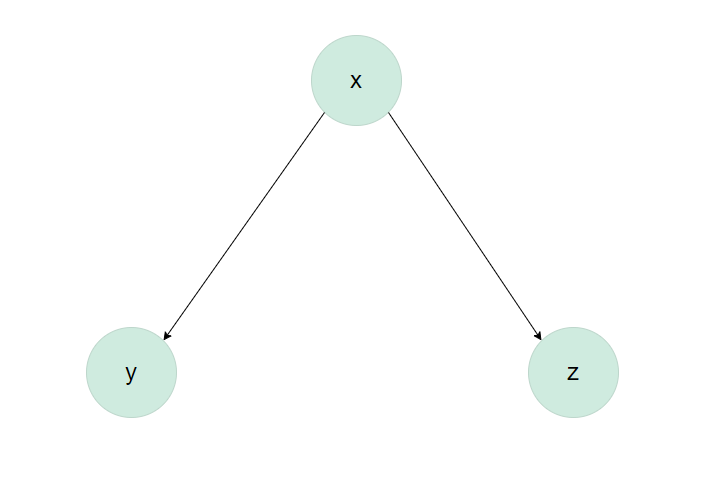
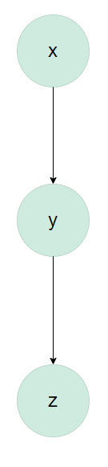
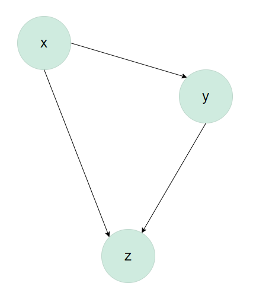

**See Canvas for HW #4 assignment due date**. Complete all of the following problems. Ideally, the theoretical problems should be answered in a Markdown cell directly underneath the question. If you don't know LaTex/Markdown, you may submit separate handwritten solutions to the theoretical problems. Please do not turn in messy work. Computational problems should be completed in this notebook (using the R kernel is preferred). Computational questions may require code, plots, analysis, interpretation, etc. Working in small groups is allowed, but it is important that you make an effort to master the material and hand in your own work. 


## A. Theoretical Problems

## Problem A.1 Causality (20 points)

**Please answer the following three questions. Each answer should be clearly labeled, and a few sentences to a paragraph long.**

1. In your own words, describe the fundamental problem of causal inference. How is this problem related to the counterfactual definition of causality?


2. Describe the use of "close substitutes" as a solution to the fundamental problem of causal inference. How does this solve the problem?


3. What is the difference between a *deterministic* theory of causality and a *probabilistic* theory of causality?

*YOUR ANSWER HERE*
1. The fundamental problem of causal inference is that causal effect cannot be made directly because, while there are many potential outcomes that can come from an observed experimental or observational study only one of those can be observed for a given study. 
i.e. I think this means we can't perfectly find out if something causes something (because there is usually the presence of other factors we can't control.)

2. 

3. Deterministic theory causality is about the nature of causality where an effect follows from a cause. Probabilistic theory is about the nature of causality when the *existence* of a cause impacts the ***probability*** of an effect. 

## Problem A.2 Causal inference and ethics (20 Points)

How we think about causality, and the statistical models that we use to learn about causal relationships, have ethical implications. The goal of this problem is to invite you to think through some of those issues and implications.

Statisticians, data scientists, researchers, etc., are not in agreement on the best ways to study and analyze important social problems, such as racial discrimination in the criminal justice system. Lily Hu, a PhD candidate in applied math and philosophy at Harvard, recently [wrote](https://lpeproject.org/blog/law-liberation-and-causal-inference/) that disagreements about how to best study these problems "well illustrate how the nuts and bolts of causal inference...about the ...'effects of race'...feature a slurry of theoretical, empirical, and normative reasoning that is often displaced into debates about purely technical matters in methodology."

Here are some resources that enter into or comment on this debate:

1. [Statistical controversy on estimating racial bias in the criminal justice system](https://statmodeling.stat.columbia.edu/2020/07/06/statistical-controversy-on-racial-bias-in-the-criminal-justice-system/)

2. [Can Racial Bias in Policing Be Credibly Estimated Using Data Contaminated by Post-Treatment Selection?](https://dcknox.github.io/files/KnoxLoweMummolo_PostTreatmentSelectionPolicing.pdf)

3. [A Causal Framework for Observational Studies of Discrimination](https://5harad.com/papers/post-treatment-bias.pdf)

**Please read Lily Hu's Boston Review [article](https://www.bostonreview.net/articles/race-policing-and-the-limits-of-social-science/) and Andrew Gelman's blog post ["Statistical controversy on estimating racial bias in the criminal justice system"](https://statmodeling.stat.columbia.edu/2020/07/06/statistical-controversy-on-racial-bias-in-the-criminal-justice-system/) (and feel free to continue on with the other two papers!) to familiarize yourself with some of the issues in this debate. Then, write a short essay (250-500 words) summarizing this debate. Some important items to consider:**

1. How does the "fundamental problem of causal inference" present itself in these discussions? 


2. What are some "possible distortionary effect[s] of using arrest data from administrative police records to measure causal effects of race"? (See Lily Hu's blog post for this quote.)


3. What role do assumptions (both statistical and otherwise) play in this debate? To what extent are assumptions made by different researchers falsifiable?

*YOUR ANSWER HERE*

So the debate appears to be centered on whether determination of racial (or gender, etc.) bias and policing is something that can be determined and evaluated from statistical analysis (with data from the social masses). Or perhaps even more foundationally, whether causal inference (and/or causal effects) is valid regarding the type of data is being analyzed ("post treatment" data, like arrest data in which the arrest already happened vs. whether or not an arrest happens, and etc. etc.)


## B. Computational Problems

## Problem B.1 Extra features in causal models: include or not?!

Imagine that a team of researchers is investigating whether a pedagogical intervention causes an increase in students' conversational skills in Italian. Including a properly-chosen "control variable" in the analysis is important in terms of statistical power and precision. (A control variable is a predictor/explanatory variable/feature that controls for variability.) As a result, the researchers decide to administer an Italian vocabulary test to students, and include their score on this test in their analyses as a control variable. 


But if the researchers administer the vocabulary test *after* the pedagogical intervention (i.e., the vocabulary test is "post-treatment"), it’s possible that the vocabulary scores are themselves affected by the intervention as well. If the pedagogical intervention is "post-treatment", controlling for it will negatively impact the regression model.

In this question, let's simulate some data according to various causal models to see how causal assumptions will impact the regression model. Here's a summary of the variables that we will simulate:

- `x` refer to the causal variable, i.e., the pedagogical intervention. This is a binary variable (either the student received the pedagogical intervention or they did not)

- `y` is the effect/response variable, i.e., a student's conversational skills in Italian. It is a continuous variable (perhaps an exam score)

- `z` refers to the post-treatment variable, i.e., the Italian vocabulary scores in our example. 

Since `z` is a post-treatment variable, it’s possible that it is itself influenced directly or indirectly by `x`. Let's explore various options.

**B.1 (a) [5 points] Draw a causal diagram such that `x` affects both `y` and `z`, but `z` and `y` don’t influence each other.**

*YOUR ANSWER HERE*




The cell directly below simulates data such that `x` causes both `y` and `z`, but `z` and `y` don’t influence each other. That is, `x` is a so-called "common cause" of `y` and `z`.


**B.1 (b) [15 points] Run two linear regressions, one with *both* `x` and `z` as predictors and one with only `x` as a predictor. Identify the average causal effect of `x` on `y`. Is it the same in each regression? If not, which one is the correct causal effect? That is, which regression is more appropriate and why?**


```{R}
set.seed(1983)
B1b = function(n_per_group, beta_xy = 1, beta_xz = 1.5) {
  # Create x (with n_per_group 0s and n_per_group 1s)
  x = rep(c(0, 1), each = n_per_group)
  
  y = beta_xy*x + rnorm(2*n_per_group)
  
  # x affects z
  z = beta_xz*x + rnorm(2*n_per_group)
  
  # Create data frame
  dfr = data.frame(x = as.factor(x), y, z)
  
  # Add info: z above or below median (for plotting)
  dfr$z_split = factor(ifelse(dfr$z > median(dfr$z), "above", "below"))
  
  # Return data frame
  return(dfr)
}

df_B1b = B1b(n_per_group = 100)
# Type 'df_case1' to inspect.
```


```{R}
#YOUR CODE HERE
head(df_B1b)
```
```{r}
single_pred <- lm(y ~ x, data = df_B1b)
summary(single_pred)
```

```{r}
mult_pred <- lm(y ~ x + z, data = df_B1b )
summary(mult_pred)
```


YOUR ANSWER HERE

**B.1 (c) [20 points] Now assume `x` causes `y` directly, and `y` in turns causes `z`. Draw a causal diagram and simulate data according to this causal graph (keep the effect of `x` on `y` equal to 1). Then run two linear regressions, one with *both* `x` and `z` as predictors and one with only `x` as a predictor. Identify the estimated average causal effect of `x` on `y`. Is it roughly the same in each regression? If not, which one is the correct causal effect? That is, which regression is more appropriate and why?**


```{R}
#YOUR CODE HERE
B1c = function(n_per_group, beta_xy = 1, beta_yz = 1.5) {
  # Create x (with n_per_group 0s and n_per_group 1s)
  x = rep(c(0, 1), each = n_per_group)
  
  y = beta_xy*x + rnorm(2*n_per_group)
  
  # y affects z
  z = beta_yz*y + rnorm(2*n_per_group)
  
  # Create data frame
  dfr = data.frame(x = as.factor(x), y, z)
  
  # Add info: z above or below median (for plotting)
  dfr$z_split = factor(ifelse(dfr$z > median(dfr$z), "above", "below"))
  
  # Return data frame
  return(dfr)
}

df_B1c = B1c(n_per_group = 100)
```


```{R}
#YOUR CODE HERE
B1c_single <- lm(y ~ x, data = df_B1c)
summary(B1c_single)
```
```{r}
B1c_mult <- lm(y ~ x + z, data = df_B1c)
summary(B1c_mult)
```


*YOUR ANSWER HERE*

Causal diagram:



**B.1 (d) [20 points] Now, let's assume that `z` is caused by both `x` and `y`. `x` also still affects `y`. Draw a causal diagram and simulate data according to this causal graph (keep the effect of `x` on `y` equal to 1). Then run two linear regressions, one with *both* `x` and `z` as predictors and one with only `x` as a predictor. Identify the estimated average causal effect of `x` on `y`. Is it roughly the same in each regression? If not, which one is the correct causal effect? That is, which regression is more appropriate and why?**


```{R}
#YOUR CODE HERE
B1d = function(n_per_group, beta_xy = 1, beta_xz = 1.5, beta_yz=1.5) {
  # Create x (with n_per_group 0s and n_per_group 1s)
  x = rep(c(0, 1), each = n_per_group)
  
  y = beta_xy*x + rnorm(2*n_per_group)
  
  # x an y affects z
  z = beta_xz*x + beta_yz*y + rnorm(2*n_per_group)
  
  # Create data frame
  dfr = data.frame(x = as.factor(x), y, z)
  
  # Add info: z above or below median (for plotting)
  dfr$z_split = factor(ifelse(dfr$z > median(dfr$z), "above", "below"))
  
  # Return data frame
  return(dfr)
}

df_B1d = B1d(n_per_group = 100)
```


```{R}
#YOUR CODE HERE
B1d_single <- lm(y ~ x, data = df_B1d)
summary(B1d_single)
```

```{r}
B1d_mult <- lm(y ~ x + z, data = df_B1d)
summary(B1d_mult)
```


*YOUR ANSWER HERE*



