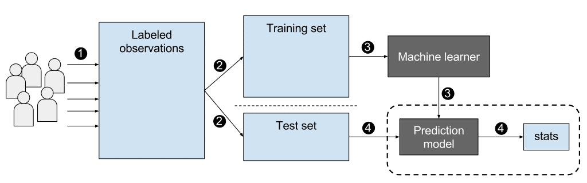

```{r, message=FALSE, warning=FALSE}
library(EBImage)
```

```{r}
img = readImage("supervised_ml.png")
display(img, method = "raster")
```

# Machine Learning {.unnumbered}

```{r, echo=FALSE, message=FALSE, warning=FALSE}
options(digits=3)
set.seed(1)
library(tidyverse)
library(dslabs)
ds_theme_set()
```

# Introduction

Perhaps the most popular data science methodologies come from *Machine Learning*. Machine learning success stories include the hand writing zip code readers implemented by the postal service, speech recognition such as Apple's Siri, movie recommendation systems, spam and malware detectors, housing prices, stock market outcomes, and driver-less cars. While artificial intelligence algorithms, such as those used by chess playing machines, implement decision making based on programmable rules derived from theory or first principles, in Machine Learning decisions are based on algorithms built on data.

## Notation

Data comes in the form of

1.  the ***outcome*** we want to predict and
2.  the ***features*** that we will use to predict the outcome.

We want to build an algorithm that takes feature values as input and returns a prediction for the outcome when we don't know it. The machine learning approach is to use a dataset for which we do know the outcome to ***train*** the algorithm for future use.

Here we will use $Y$ to denote the outcome and $X_1, \dots, X_p$ to denote features. **Features are sometimes referred to as predictors or covariates**.




Prediction problems can be divided into categorical and continuous outcomes. For categorical outcomes, the outcome $Y$ can be one of $K$ classes. The number of classes can vary greatly across applications. For example, for handwritten digits, $K = 10$ with the classes being the digits 0, 1, 2, 3, 4, 5, 6, 7, 8, and 9. In speech recognition, the outcome is all possible words we are trying to detect. Spam detection has two outcomes: spam or not spam. Here we denote the $K$ categories with indexes $k=1,\dots,K$. However, for binary data we will use $k = 0,1$.

The general setup is as follows. We have a series of features and an unknown outcome we want to predict:

```{r,echo=FALSE}
n <- 1

tmp <- data.frame(outcome=rep("?",n),
                  feature_1 = paste0("X_1"),
                  feature_2 = paste0("X_2"),
                  feature_3 = paste0("X_3"),
                  feature_4 = paste0("X_4"),
                  feature_5 = paste0("X_5"))

tmp %>% knitr::kable(align = "c")

```

To *build a model* that provides a prediction for any set of values $X_1=x_1, X_2=x_2, \dots, X_5=x_5$, we collect data for which we know the outcome.

```{r, echo=FALSE}
n <- 10
tmp <- data.frame(outcome = paste0("Y",1:n),
                  feature_1 = paste0("X_",1:n,",1"),
                  feature_2 = paste0("X_",1:n,",2"),
                  feature_3 = paste0("X_",1:n,",3"),
                  feature_4 = paste0("X_",1:n,",4"),
                  feature_5 = paste0("X_",1:n,",5"))
tmp %>% knitr::kable()

```

We use the notation $\hat{Y}$ to denote the prediction. We use the term *actual outcome* to denote what we ended up observing. So we want the prediction $\hat{Y}$ to match the *actual outcome*.

## Categorical versus Continuous

The outcome $Y$ can be categorical (which digit, what word, spam or not spam, pedestrian or empty road ahead) or continuous (movie ratings, housing prices, stock value, distance to pedestrian). The concepts and algorithms we learn here apply to both. However, there are some differences in how we approach each case so it is important to distinguish between the two.

When the outcome is categorical we refer to the task as ***classification***. Our predictions will be categorical just like our outcomes and they will be either correct or incorrect. When the outcome is continuous we will refer to the task as ***prediction***. In this case our predictions will not be either right or wrong but some distance away from the actual outcome. This term can be confusing since we call $\hat{Y}$ our prediction even when it is a categorical outcome. However, throughout the lecture, the context will make the meaning clear.

Note that these terms vary among courses, textbooks, and other publications. Often *prediction* is used for both categorical and continuous and *regression* is used for the continuous case. Here we avoid using *regression* to avoid confusion with our previous use of the term *linear regression*. In most cases it will be clear if our outcomes are categorical or continuous so we will avoid using these terms when possible.

The first part of this module deals with categorical values and the second with continuous ones.

# Case Study 1: Digit reader

Let's consider an example. The first thing that happens to a letter when they are received in the post office is that they are sorted by zip code:

```{r, echo=FALSE}
knitr::include_graphics("https://d79i1fxsrar4t.cloudfront.net/assets/img/docs/zip-code-digits.47d1a727.png")
```

Originally humans had to sort these by hand. To do this they had to read the zip codes on each letter. Today thanks to machine learning algorithms, a computer can read zip codes and then a robot sorts the letters. In this lecture we will learn how to build algorithms that can read a digit.

The first step in building an algorithm is to understand what the outcomes and features are. Below are three images of written digits. These have already been read by a human and assigned an outcome $y$. These are considered known and serve as the **training set**.

```{r, echo=FALSE, cache=TRUE, message=FALSE}
url <- "https://raw.githubusercontent.com/datasciencelabs/data/master/hand-written-digits-train.csv"
digits <- read_csv(url)
tmp <- lapply( c(1,4,5), function(i){
    expand.grid(Row=1:28, Column=1:28) %>%  
      mutate(id=i, label=digits$label[i],  
             value = unlist(digits[i,-1])) 
})
tmp <- Reduce(rbind, tmp)
tmp %>% ggplot(aes(Row, Column, fill=value)) + 
    geom_raster() + 
    scale_y_reverse() +
    scale_fill_gradient(low="white", high="black") +
    facet_grid(.~label)
```

The images are converted into $28 \times 28 = 784$ pixels and for each pixel we obtain a grey scale intensity between 0 (white) and 255 (black) which we consider continuous for now. We can see these values like this:

```{r, echo=FALSE}

tmp %>% ggplot(aes(Row,Column,fill=value)) + 
  geom_point(pch=21) + 
  scale_y_reverse() +
  scale_fill_gradient(low = "white",high="black") +
  facet_grid(.~label)


```

For each digit $i$ we have a categorical outcome $Y_i$ which can be one of 10 values: $0,1,2,3,4,5,6,7,8,9$ and features $X_{i,1}, \dots, X_{i,784}$. We use bold face $\mathbf{X}_i = (X_{i,1}, \dots, X_{i,784})$ to distinguish the vector from the individual predictors. When referring to an arbitrary set of features we drop the index $i$ and use $Y$ and $\mathbf{X} = (X_{1}, \dots, X_{784})$. We use upper case variables because, in general, we think of the predictors as random variables. We use lower case, for example $\mathbf{X} = \mathbf{x}$, to denote observed values.

The machine learning task is to build an algorithm that returns a prediction for any of the possible values of the features. Here we will learn several approaches to building these algorithms. Although at this point it might seem impossible to achieve this, we will start with a simpler example, and build up our knowledge until we can attack this more complex example.

# Accuracy and the confusion matrix

Here we consider a prediction task based on the height data.

```{r}
library(dslabs)
data(heights)
```

We want to predict sex based on height. It is not a realistic example but rather one we use as an illustration that will help us start to understand the main concepts. We start by defining the outcome and predictor. In this example we have only one predictor.

```{r}
y <- heights$sex
x <- heights$height

```

This is clearly a categorical outcome since $Y$ can be `Male` or `Female`. Predicting $Y$ based on $X$ will be a hard task because male and female heights are not that different relative to within group variability. But can we do better than guessing? We can code a random guess like this:

```{r}
set.seed(1)
N <- length(y)
y_hat <- sample(c("Male","Female"), N, replace = TRUE)   # any hat means making prediction

```

First, we will quantify what it means to do better. **The confusion matrix breaks down the correct and incorrect classifications**:

```{r}

table(predicted = y_hat, actual = y)


```

The *accuracy* is simply defined as the overall proportion that is predicted correctly:

```{r}

mean(y_hat == y)

```

Not surprisingly, by guessing, our accuracy is about 50%. No matter the actual sex, we guess female half the time. Can we do better? We know males are slightly taller,

```{r}
heights %>% group_by(sex) %>% summarize(mean(height), sd(height))

```

so let's try to use our covariate. Let's try the approach "predict `Male` if height is within two standard deviations from the average male" (69.31 - 2(3.61)) $\approx$ 62:

```{r}
y_hat <- ifelse(x >= 62, "Male", "Female")

```

The accuracy goes way up from 0.50 now:

```{r}
mean(y == y_hat)

```

But can we do better? We can examine the accuracy obtained for other cutoffs and then pick the value that provides the best results. However, if this optimization feels a bit like cheating to you, you are correct. By assessing our approach on the same dataset that we use to optimize our algorithm, we will end up with an over-optimistic view of our algorithm. In a later section we cover this issue, referred to as ***overtraining*** (or ***overfitting***) in more detail.

# Training and test sets

The general solution to this problem is to split the data into **training and testing sets.** We build the algorithm using the training data and test the algorithm on the test set. In a later section we will learn more systematic ways to do this, but here we will split the data in half.

We now introduce the `caret` package that has several useful functions for building and assessing machine learning methods. For example, the `createDataPartition` automatically generates indexes. The argument `times` is used to define how many random samples of indexes to return, the argument `p` is used to define what proportion of the data to index, and the argument `list` is used to decide if we want the indexes returned as a list or not.

```{r, message=FALSE}
library(caret)
set.seed(1)
train_index <- createDataPartition(y, times = 1, p = 0.5, list = FALSE)
head(train_index)

```

We can use this index to define the training and test sets:

```{r}

train_set <- heights[train_index,]
test_set <- heights[-train_index,]
head(train_set)
head(test_set)

```

Now let's use the train set to examine the accuracy of 11 different cutoffs:

```{r}

cutoff <- seq(60,70)
accuracy <- map_dbl(cutoff, function(x){
  y_hat <- ifelse(train_set$height >= x, "Male", "Female")
  mean(y_hat == train_set$set)
})

```

We can make a plot showing the accuracy on the training set for males and females.

```{r accuracy-v-cutoff, echo=FALSE}

data.frame(cutoff,accuracy) %>% ggplot(aes(cutoff, accuracy)) + geom_point() + geom_line()
 
```

We see that the maximum value is:

```{r}
max(accuracy)
# 
```

much higher than 0.5, and it is maximized with the cutoff:

```{r}

best_cutoff <- cutoff[which.max(accuracy)]
best_cutoff
# outputted 65 on prof's code

```

Now we can test this cutoff on our test set to make sure our accuracy is not overly optimistic:

```{r}

y_hat <- ifelse(test_set$height > best_cutoff, "Male", "Female")

```

We see that it is lower than the accuracy observed for the training set, but it is still better than guessing. And by testing on a dataset that we did not train on, we know we did not cheat.
